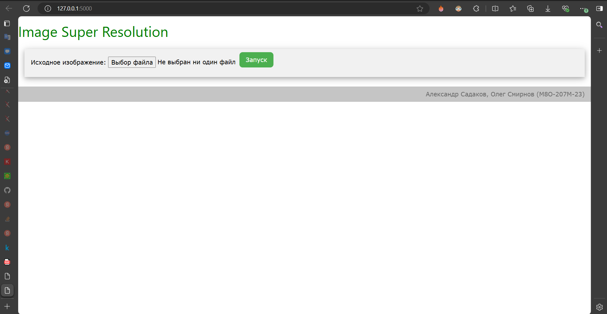
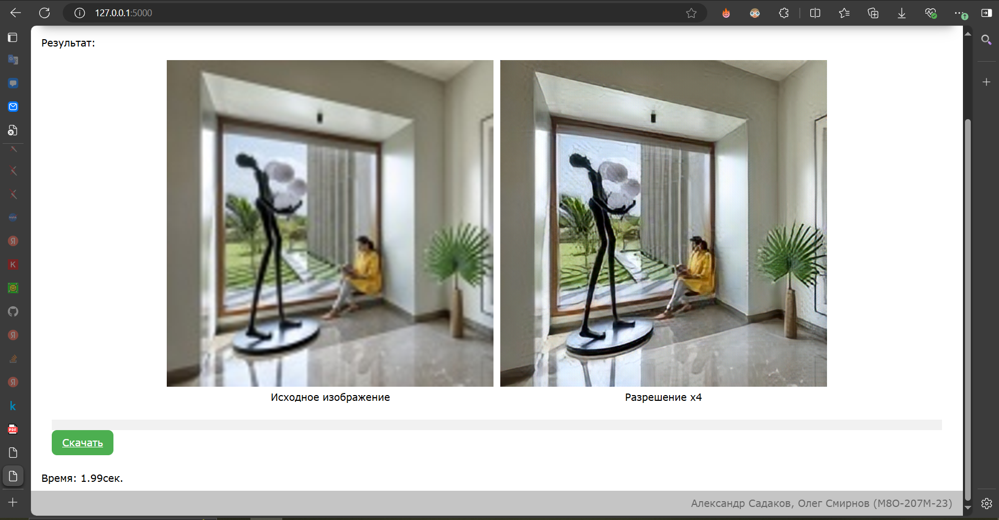

# Image Super Resolution

Авторы: Александр Садаков, Олег Смирнов
Группа: М8О-207М-23

---
# Сборка и запуск

Команды для сборки и запуска контейнера:
```
# Build
docker build -t cv-flask .
# Run
docker run -p 5000:5000 cv-flask:latest
```
---
# Описание проекта:

Для увеличения разрешения картинки использовалась готовая модель ESRGAN (https://www.kaggle.com/models/kaggle/esrgan-tf2), реализованная на TensorFlow.
Преимуществами этой модели являются:
- малый размер
- 4х кратное увеличение разрешения

Модель загружается напрямую из проекта. Изображения для тестирования находятся в папке `tests`.

Форма для взаимодействия с пользователем: `index.html`.

Для работы веб приложения используется `flask`.

---
# Инструкция по применению:

Шаг 1. Зайдите на http://127.0.0.1:5000

Шаг 2. При запуске отображается следующий интерфейс.


Шаг 3. После загрузки изображения стоит нажать кнопку "Запуск".

Шаг 4. По завершению работы будет выведено исходное изображение, увеличенное в 4 раза, и изображение, полученное моделью ESRGAN.  


Шаг 5. Полученное изображение можно скачать (а так же посмотреть на время работы)
